

——驻法国蒙彼利埃（Montpellier, France）中文特工 @Allonautilus

一切开始于2017年2月。注册账号六个月、正式入坑五个月的我，当时正在例行刷 ingress.com/events 并对着千里之外的活动举办地望洋兴叹，突然就发现新公布的一批 Mission Day 城市其中一个位于西班牙。

西班牙？总算有一个近一点的了。Google Maps 了一下，Valencia到Montpellier只有六百多公里远！

然后就开始纠结了一下：那个学期，我每个周六上午都有课，而且MD四天之后我就要去考报名费170€的 DELF B2。然而再一想，这是我为数不多的有机会参加的官方活动了，而且，如果错过了这一次，还不知道下次再遇上附近有活动要等多久。于是当后来确定了3月11日那一个周六不上课，并在内心向自己保证要在接下来的日子里更加努力地复习法语，便RSVP并定下了去Valencia的机票和青旅。

这次 Mission Day 是在当地传统的Fallas节庆期间举办的，虽然节日还没有正式开始，但是准备工作已经在进行，而且也有前期的烟火表演。

主办方的公告里还特别提醒说，这次活动跟地方警察局报备过，所以如果警察因为你行动鬼鬼祟祟而上来盘问，只要跟他们解释说自己是Ingress玩家就好了；如果警察还不知道，就告诉他们这是个跟 Pokémon Go 同类的游戏，可以把玩法演示给他们看。（所以小畜生是有多火……）

## 3月10日

周五这一天本来有两节课，但是为了赶飞机就只能都逃掉了。

一大早便从宿舍出发，通过 TGV Max 订了从 Montpellier Gare Saint Roch 到巴黎CDG机场的免费TGV票，TGV上的一个上午就在愉快而激动地玩手机刷微博中度过了，电量还剩不到30%的时候去拿充电宝，才突然意识到了我带了两个充电宝却没带数据线这一悲惨的事实……

吓得我把手机打开了超级省电模式不敢再拿出来，还好到了CDG机场之后在Relay便利店买到了6€一根的数据线，质量非常不怎么样（之后没用到两个月就坏掉了），不过至少靠着新买的数据线开始充电之后终于又可以愉快地玩手机。

在候机时遇到了一名看上去非常商务精英的中国男子，在Valencia工作，西班牙语说得很流利，此次从北京去Valencia通过巴黎转机（还是头等舱）。就随便聊了一段时间，听他吐槽了巴黎的安全状况（“我这样拖着行李箱都不敢出机场去大街上走的，巴黎这种地方怕是没走两步就要被抢走了”），然后就说到了我去Valencia是为什么的话题。

我：“我是趁着周末去旅游的。”

他：“旅游的话应该下周再去嘛，下周Fallas节正式举办的时候才是旅游旺季，游客都是那个时候才去的。”

我：“其实……是因为一个游戏活动在这周末举行_(:з)∠)_”

可以感受到大叔内心os：现在的年轻人，周末打飞的出国就为了去玩游戏见网友？

我解释说这是个官方活动，还是跟当地旅游局合作的，才算是稍微打消了一些他的疑虑。

这周法国的机场在罢工，不过我的航班还没有受太多影响，仅仅晚点了一个小时，顺利地在下午到达了Valencia。

下飞机之后，我一打开Ingress，就发现机场周围被扔了满地的 Portal Keys，我还有些惊讶地在群里吐槽了一句。后来才发现这几天的Valencia到处都有agents乱扔垃圾。

青旅就在Valencia的历史街区，距离 Mission Day 任务的范围也不远，算是非常方便的位置。

这次住青旅也是给我带来了一次难得的经历，刚进房间看到里面有一个男生时整个人都懵掉了，才想起这次预订的是混合房间。不过毕竟是11€一晚的青旅，反正之前就听说欧洲的青旅很多是混合房间，也是总该体验一下的经历😂

然后便开始跟室友们聊天，有趣的是，六人间里两个男生都是马赛人，于是和他们用磕磕绊绊的夹杂着英语的法语交流，当时已经完全在怀疑自己：像我这样说话都说不利索还考个鬼的B2哦！

安顿好之后，傍晚出门去做Fallas庆典期间的限量版拼图任务。这套拼图还是当地玩家特地为了这次 Mission Day 而申请的。我查了一下这是个什么节日，不过也没太看明白，大概就是当地人放烟花并载歌载舞送瘟神之类的吧【x

当时群里还有人说“你们小心哦，这个任务有一段在红灯区的范围，建议不要晚上去做”，吓得我问傍晚七八点时那里是否安全，当地大佬让我放心（大概对于他们来说这个时间还不算太晚吧），于是我就放心地去做了。

任务路线有一些地方在历史街区，也有另一段在比较僻静的居民区小巷子里，不过我倒一直没有发现什么比较明显的红灯区的迹象。路上还遇到了好几波其他的agents，鬼鬼祟祟地像是在搞大新闻。后来做到一半的时候，遇到一个绿军也在做同一个拼图，作为熟悉路线的本地人，他热情地建议我跟他一起刷，我也愉快地接受了邀请，途中一边抢 625 AP 一边用彼此都说得不怎么好的英语聊天。

切过之后的图看起来有点乱，完整的图实际上是这个样子↓

刷完这套四排任务之后，我准备再刷另一套单排任务，不过绿军小伙之前已经做完，就先自己回去了，我一边跟他告别一边在scanner上点开了第一个任务，却弹出页面“请输入通关密码，（西班牙语）”……

我：“What’s all this???!”

他哈哈大笑着帮我找到了一个西班牙语维基百科的页面，原来那些密码是要对一首关于Fallas节日的叙事长诗进行短文填空，面对着一片西班牙语，只能逐个字母地对照着填，不过好歹还算顺利地完成了任务。

MD前夜22:00，刷完了五排任务后，满足地回到青旅养精蓄锐。

## 3月11日

毕竟不熟当地，没有敢夜刷，乖乖地睡到了早上六点起床，六点半开始出门刷任务。

主办方体贴地准备了一个 Google Maps 版MD地图，每个waypoint的位置和行进路线都有标明，导入之后只要打开Google Maps就可以轻松按图索骥。

出门时天还不亮，沿着任务路线一路走过去，也还没有足够的光线以好好欣赏沿路的风景，只有路过市场的时候，看到摊主开始摆摊准备卖早点，才算见到了点人间烟火。

就这样在寂静中等到了日出，天亮之后总算能欣赏风景了。

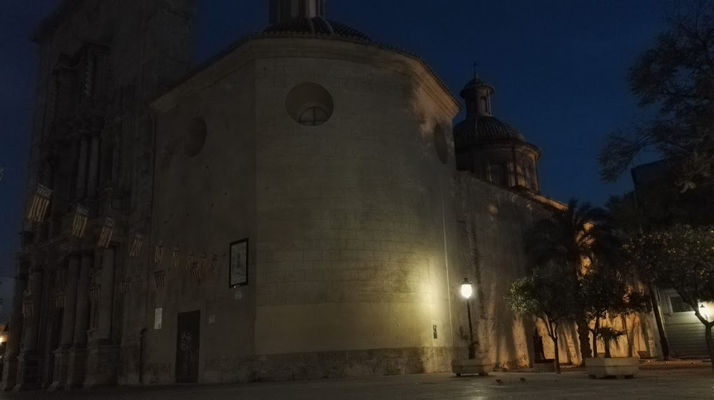 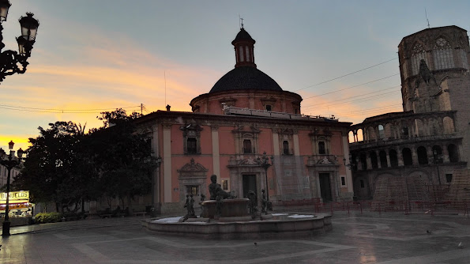 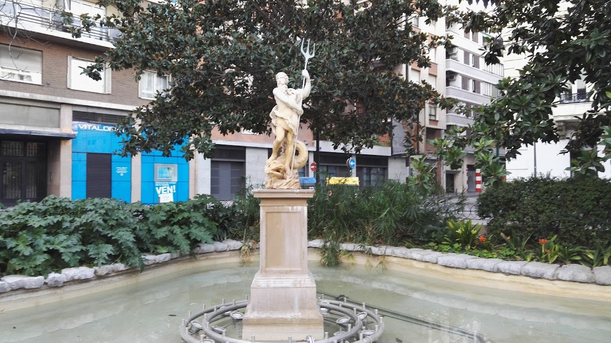 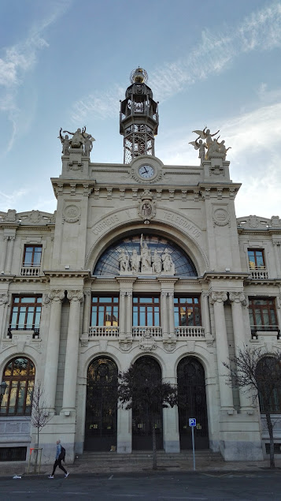 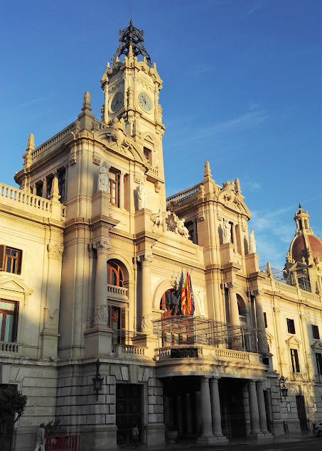 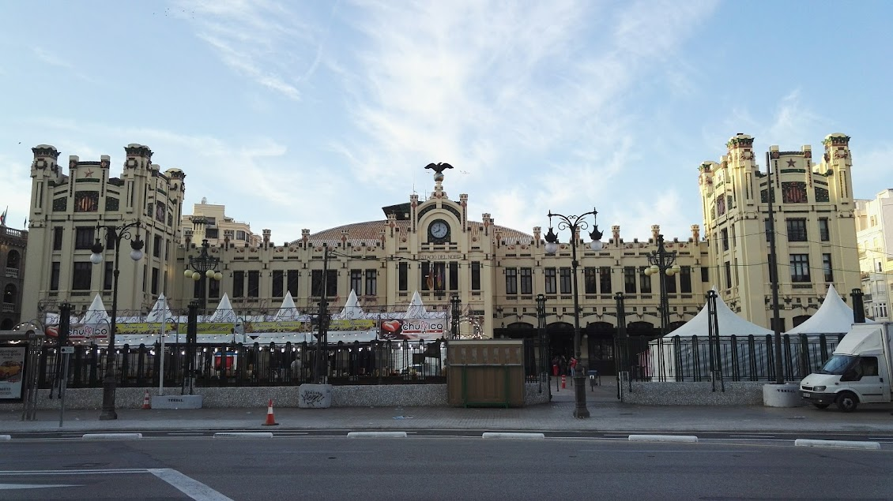 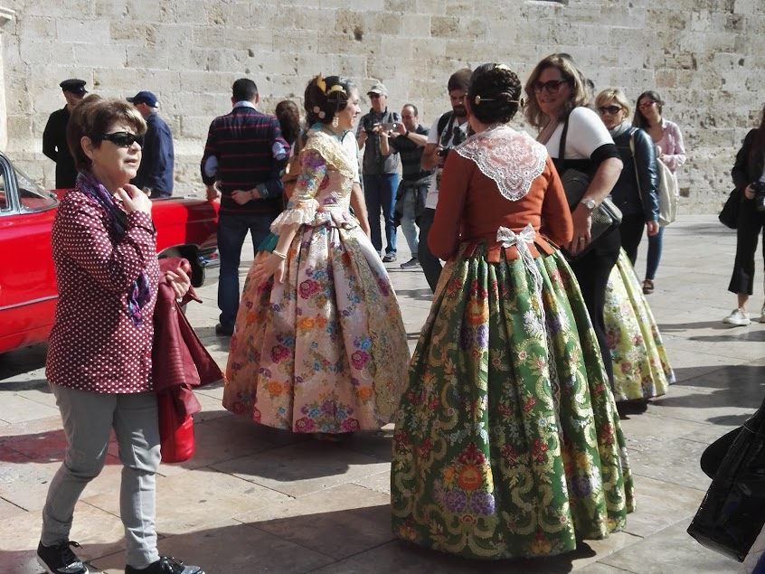 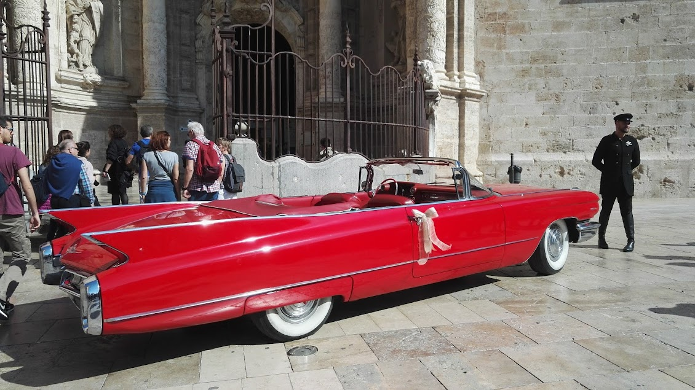  

一上午就在一边慢悠悠地做任务一边欣赏风景中度过，走到了合影处，可能因为挤在一起等的人太多，就先在一旁提前支起桌子办签退。

这次MD一共有24个任务，完成6个就符合最低要求，这一点之前在群里还被吐槽“别人家的MD都是12个才算完成，你们这边变成了6个就可以，是因为南方人比较懒吗？”

每个玩家可以领一个免费pack，资金来源是群众自发捐款（包括paypal和现场投币两种形式），现场捐款箱做成了红桶的样子，超可爱。我见到红桶也忍不住也扔了个1€硬币进去。

Pack包含一条橙色领巾、三张Valencia城市Bio cards、一个徽章和一条腕带。

合影地点是一个本来就日常挤满游客的广场，这一群拿着手机、打扮怪异的特工毫不意外地引起了围观，我在一旁站着，都被围观群众凑上来问这是在搞什么，并不会说西班牙语的我默默退后交给了旁边的友军，听着他们解释Ingrrrress（此处有销魂的弹舌音）。

合影后大家组团去不远处的另一个广场看Masclèta烟火表演，这也是Fallas节日庆典活动的一部分，每天下午都有一场。一路上人挤人，很快就和其他特工走散了，超难过的是刚系在脖子上的橙领巾也在路上挤丢了_(:з)∠)_

白日烟火没什么太有意思的地方，只能看到天上划过亮光，伴随着阵阵浓烟，只看照片没准会被误认为是恐袭现场。

烟火表演期间周围几条马路可以说是名副其实的水泄不通，继续默默吐槽，这种人挤人的场合实在太适合恐袭了……表演结束之后，人群才渐渐散开。

完成签退后无所事事的我跟着一部分人流走到了中央市场。

先尝了一下Horchata，2€一杯，之前看群里的本地玩家说这是当地的特色饮料，味道很像亚洲豆奶……嗯确实。

又在市场里买了一块手工pizza当午饭吃，在猎奇心促使下挑了个黑皮的。我拿到手就靠在旁边柜子上吃了，吃完了之后老板还热情地问我觉得味道怎么样（面对这么热情的问题当然要回答说很好吃了）。

吃饱喝足之后又去刷了一排天际线任务。

绕了一阵子之后，又回到了合影时的广场，这时广场上的喷水池谜之围了一圈人，凑近一看才发现，原来里面堆满了泡沫。

从早上六点逛到下午四点半的我已然筋疲力尽，决定最后去看一眼MD背景图的那个景点就回去休息。

Torres de Serranos 差不多是Valencia最著名的景点，这座始建于14世纪的古城门曾经有重要的军事地位。登上城门后中二病发作的我顿时脑补了一名中世纪守城士兵的日常：面对侵略者的强势火力几乎要支撑不下去，然而回头看了一眼身后城内手无寸铁的百姓，用尽最后一丝力气继续拿起弓箭浴血奋战……

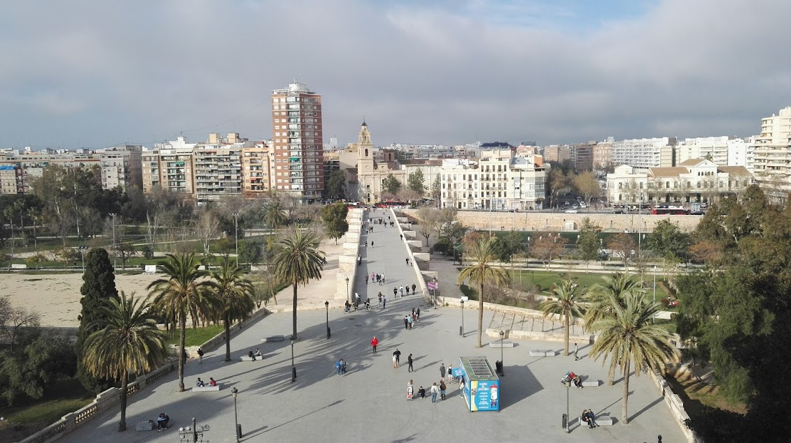 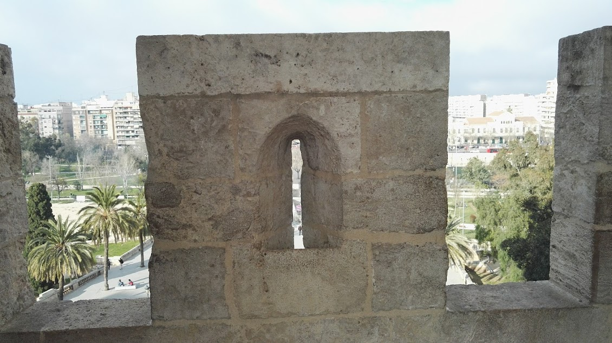 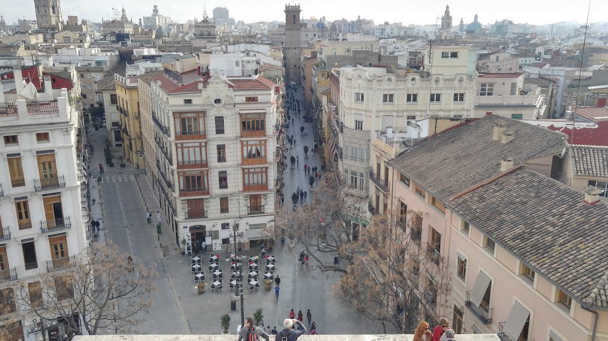 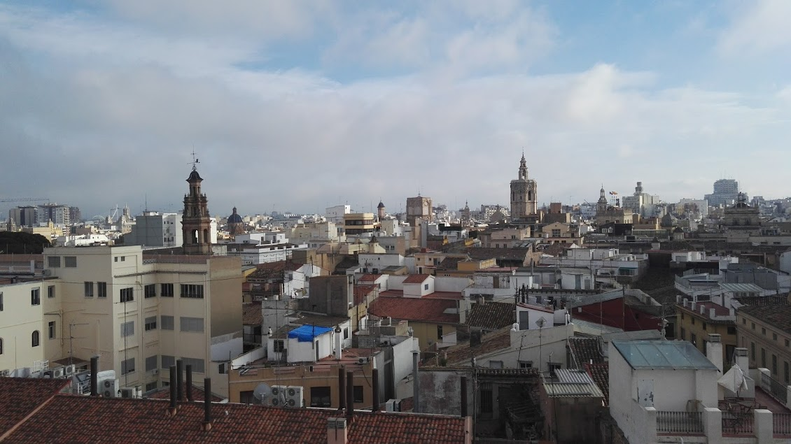 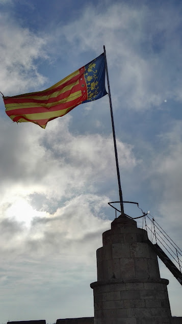 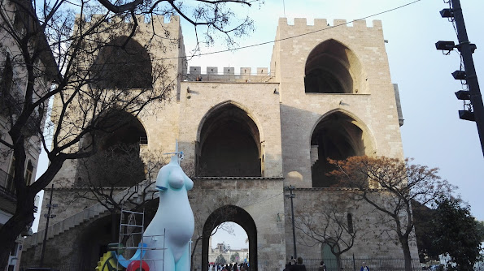  

回青旅休息了一下之后，天已经黑了，便出门买晚饭。天黑之后气温骤降，我也不愿意往远走，只好就近在旁边广场上的油条摊子上买了半打油条。

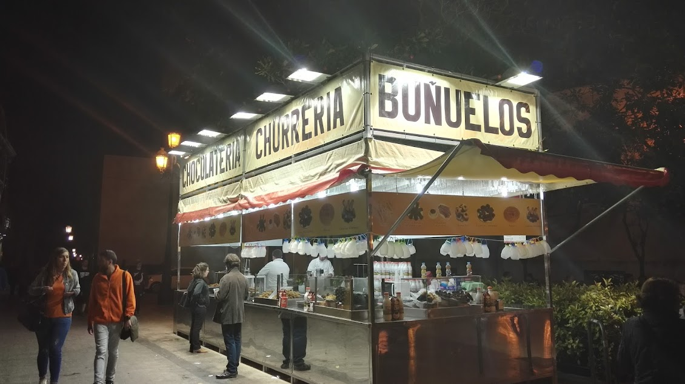

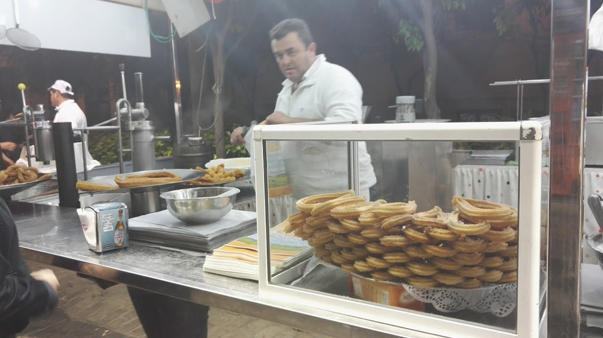



这种churros，正经一点的中文译名叫吉事果，比国内的油条要硬，吃的时候要蘸白糖或巧克力酱。也就很一般，不过来一次西班牙还是要尝一下当地特色的。

其实Valencia最著名的特色美食是西班牙海鲜烩饭Paella，然而饭店里卖的每一份至少是两人的量。独自旅游也就是在吃东西时最不方便了，没人一起吃，就只好放弃。（于是回到宿舍之后我就去家乐福买了一大盘微波炉加热版Paella，自己吃了两顿吃完。

## 3月12日

为了不耽误周一的课，周日一早就要起来赶飞机告别Valencia了。走在来时的道路上，贪婪地欣赏着一路的景色，不舍地离开这座美丽的南方小城。

到了机场，毫不意外地看到依然扔着一地 portal keys。在Comm里说了句 Goodbye Valencia，上了飞机，回到法国去继续被冻得瑟瑟发抖。

我似乎天生就对南方有着好感，即使身在南方也一直向往着更南边，在蒙彼利埃时爱着瓦伦西亚，在苏州时爱着福州。几天前在福州MD，看着闽江边各种南方特色的树木，突然就又想起了瓦伦西亚，想起了这第一次MD之行的经历。翻出移动硬盘里的照片一张张看，总算大概回忆起了八个月前的这次旅行。

最后，希望以后有更多机会能参加这样的官方活动，并许愿……明年回法国之后能有境内Anomally吧。