选择绍兴作为出来散心一日的目的地，并没有什么特别的原因，大概是看离得近，又有鲁迅这张城市名片在，总该有些什么值得一游。至于决定好这一行程之后马上买了火车票，才发现当天是个不宜出行的雨天，也没什么办法。





出发之前，在Bannergress上找到一个名为「[游鲁迅故里 看越地风情](https://bannergress.com/banner/%E6%B8%B8%E9%B2%81%E8%BF%85%E6%95%85%E9%87%8C-%E7%9C%8B%E8%B6%8A%E5%9C%B0%E9%A3%8E%E6%83%85-378d)」的组图，路线途径鲁迅故里、城市广场、西施山遗址公园三个地标，本计划就沿着任务路线作为本次绍兴一日游的行程，奈何计划赶不上变化。

自绍兴北站乘坐公交，颠簸了一个小时后总算到达了景区，我摸出手机，点开第一个任务。看着鲁迅故里景区里密密麻麻的portals，本以为这次任务会很顺利，却在快速hack完前面5个waypoints之后，发现了另外一个waypoint的要求是输入passphrase：「鲁迅故里位于哪里？」

呃……我尝试输入了「绍兴」「浙江绍兴」「越城区」乃至「鲁迅中路」，但都不是正确答案，我尝试在Telegram上搜索作者的ID，也没能找到。只是通过Google发现了几篇2017年前后的北蓝战报有这位作者出场，后面就再无音讯，大概对方早已退游很久了吧。任务只能作罢。

没了任务可做，就只能专心做一个观光客。

# 鲁迅故里

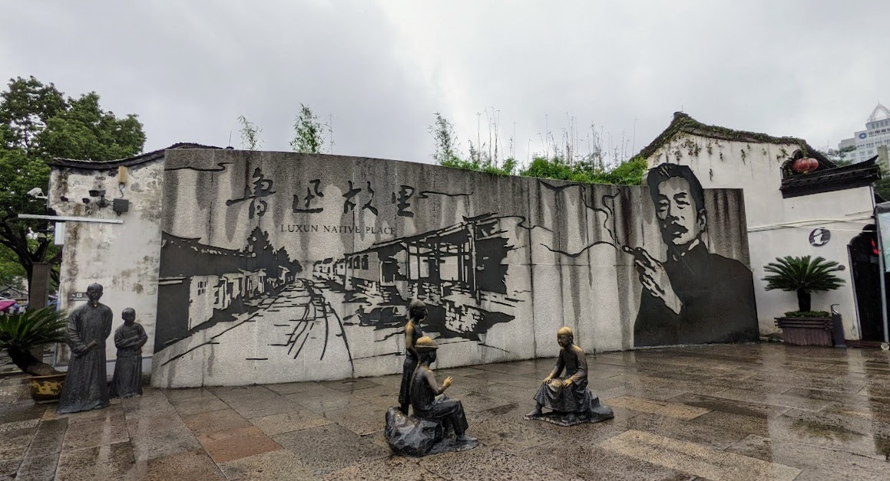

作为游绍兴必去的景点，鲁迅故里慷慨地免费开放，还是让人有些惊喜的。不过要现场扫码预约，预约了后去柜台换一张纸质门票。换票的柜台上还赫然张贴着公告，让未接种疫苗者主动登记信息，好在实际上并没有工作人员在查问。

完整的鲁迅故里，是由四个景点连带外面的仿古文化街组成的街区，包含鲁迅祖居、三味书屋、鲁迅纪念馆和鲁迅故居。

这里的旧式建筑，白墙黛瓦与苏州仿佛。

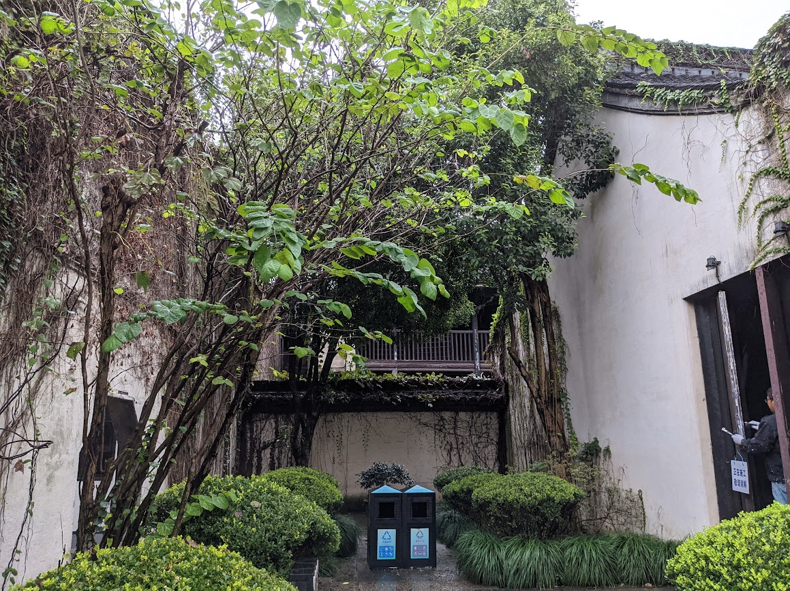 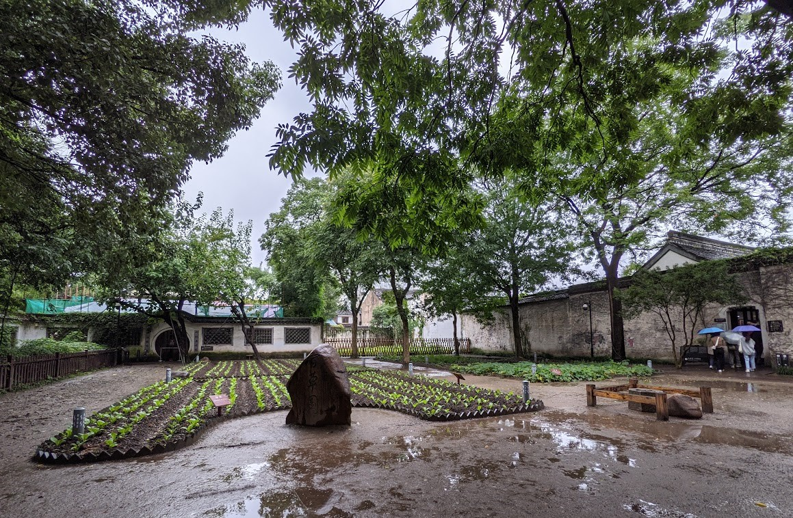 

在雨中买了杯当地向游客主推的黄酒奶茶，倒还真是酒味茶味俱全，值得一试。只笑自己不能真的温一碗黄酒来，倒是喝着这奶茶假装是喝了酒。  
我通常都不敢喝奶茶，怕难以入睡。但早上为了赶火车起得太早，就不在乎这一点茶了。  
不过平时喝了酒会困，喝了奶茶会激动，而喝了这混了酒的茶……似乎并没什么特别的反应。也不知具体对身体会怎么作用。

从前只觉得迅哥儿是个遥远的名人，这次来过绍兴他的故居，仿佛跟他多了一种更人性化的连结。知道了他笔下的那些黄酒、社戏等民俗都是如何依托于本地风土，他写的关于禹等人的小说也是写的越地同乡故事……  
他从绍兴去上海所走的距离，也就像我从上海到绍兴走来的一样。

# 青藤书屋

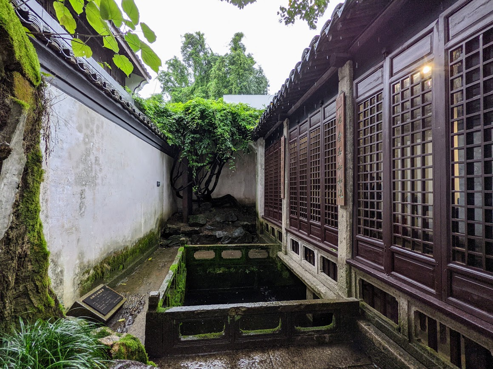 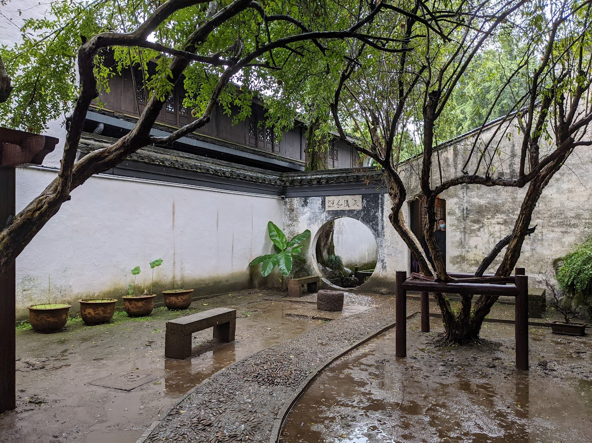 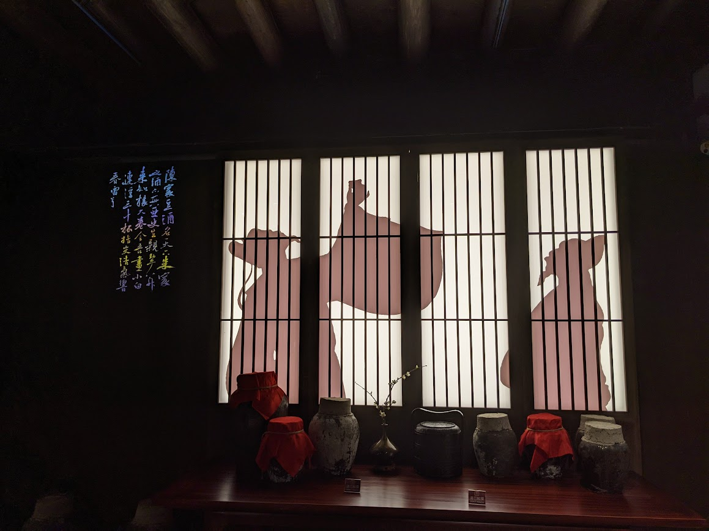

路上看到有个青藤书屋，随便进去参观了一圈，原来是徐渭的故居。

我觉得徐渭这个名字熟悉，但总想不起来是在哪里见过。看了他的生平介绍，说是与胡宗宪有关，那大概就是《明朝那些事儿》里提到过吧。

# 兰亭

我是在到绍兴的火车上，开始看这个城市的维基百科，看到这个城市古称「会稽」、「山阴」，觉得那「会稽山阴之兰亭」想必也在这个范围。想到此处，才查到了这样一个兰亭风景区。

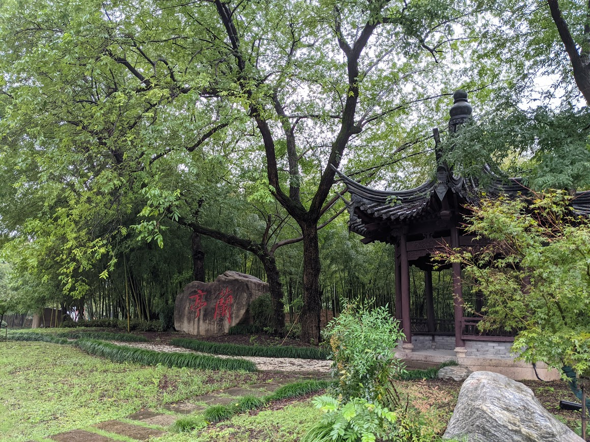 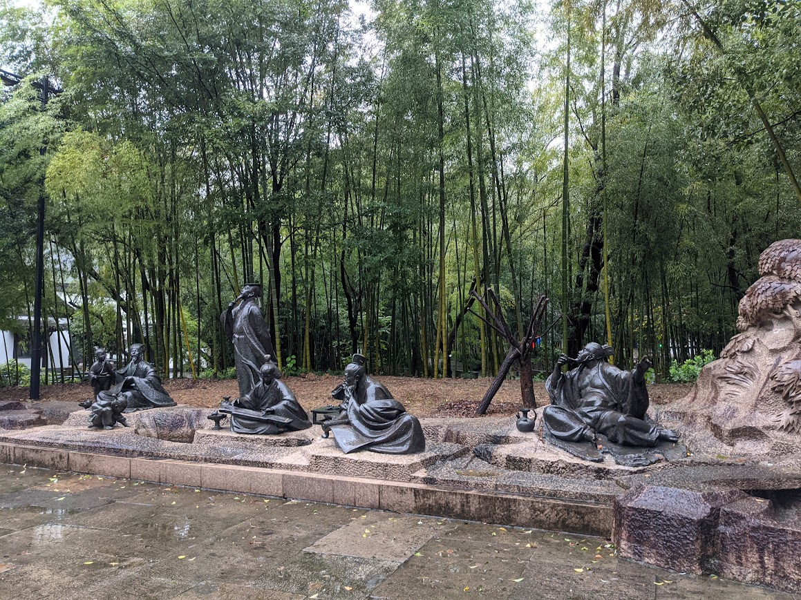 

景区很安静。我偶遇了一队日本背景的游客，有一位讲中文的女士大概是他们的朋友，在用日语给他们讲一些说明牌上的解说。

兰亭景区这里一大特色就是鹅们，想起王羲之也是爱鹅的。头一次看到如此之多的大白鹅群聚在一起，当着淅淅沥沥的小雨丝毫不惧，气定神闲地在湖里巡视着。我想起关于鹅攻击力极高的传闻，也对它们敬而远之。

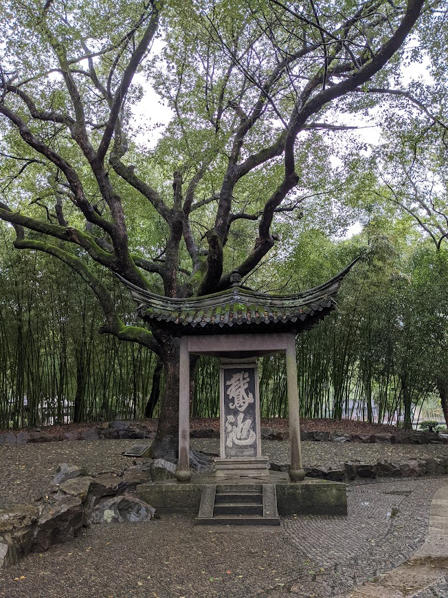 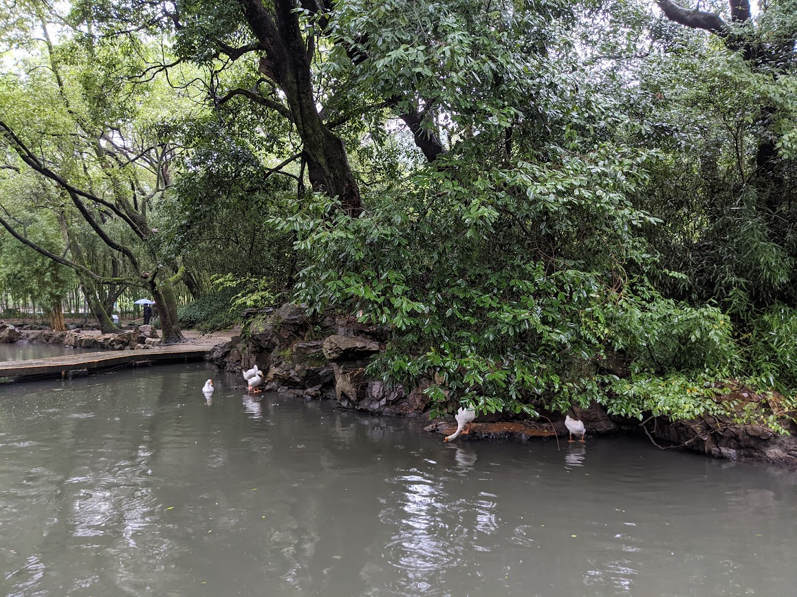

景区当中有一条溪流穿行而过，也许平时是安静而富有诗意的，但在这阴雨天里，随着雨越下越大，溪水显出了几分汹涌的气势，加上四周寂静无人，我被吓得加快脚步试图尽快远离水边。

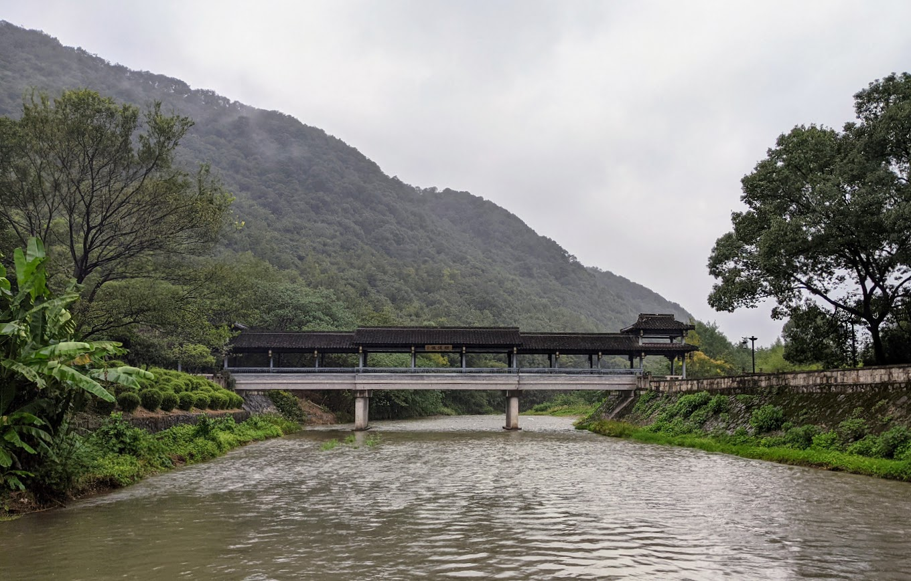

景区深处有一座兰亭书法博物馆，博物馆的布展乃至本身的建筑设计都极美，即使我对书法一窍不通，也像是被洗脑一样，沉醉于此处展览的书法，最终在博物馆商店还买了一本《兰亭集序》实体册子。

# 王守仁墓

在地图上看到了「王守仁墓」这个地点，以为会是像祢衡墓那样在路边可以随时接近，就在逛完兰亭之后的傍晚兴冲冲地跑过来。结果到了地方才发现竟然被圈在了景区里，看着门口明晃晃的闭园时间傻了眼，只好往回返。

回到公路边，在荒郊野外上看着一辆又一辆疾驰而去的重型货车，孤零零地等回城的公交等了很久。夜色里还看到附近的空中射出一道绿色光束，我一开始还有些被吓到，以为是什么诡异的事情，上网一查才知道，原来是高速上为了防止司机疲劳的常用手段= =

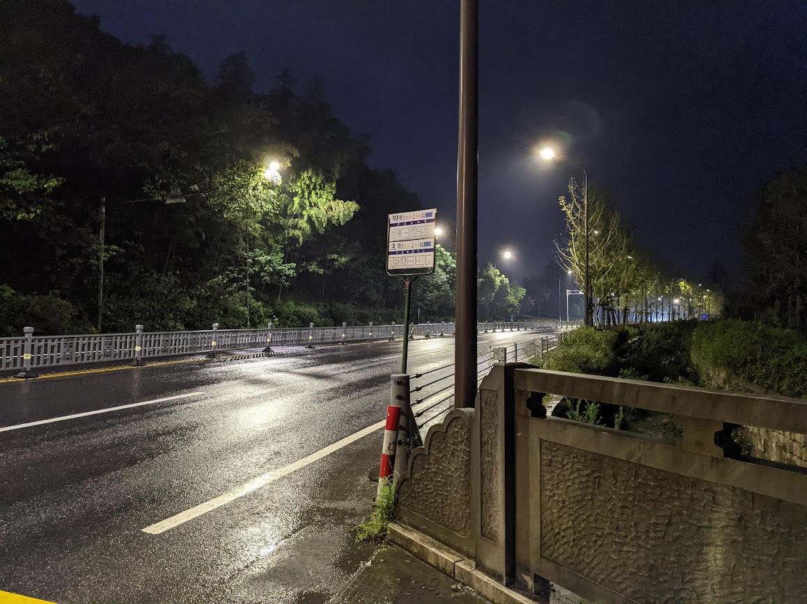 
